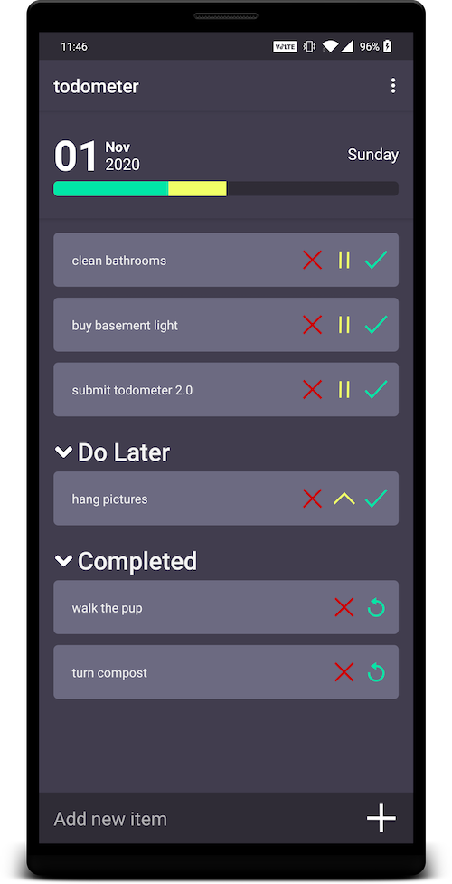

# todometer-android

A faithful native rewrite of the [todometer Electron app](https://www.github.com/cassidoo/todometer) project here on Github.

## Libraries and Frameworks Used
- [Room](https://developer.android.com/topic/libraries/architecture/room): Local database. Storage of the task objects locally on-device
- [LiveData](https://developer.android.com/topic/libraries/architecture/livedata): For Android lifecycle-aware subscriptions. Keeping the UI up to date.
- [Coroutines](https://kotlinlang.org/docs/coroutines-guide.html): Handling asynchronous tasks in a synchronous way. Coroutines were brought in as a replacement for livedata throughout the database layer.
- [Hilt](https://dagger.dev/hilt/): Dependency Injection library. I started the project using dagger, but when I migrated to MVVM, hilt's ViewModel support was enough to convince me to make the switch.
- [Lottie](https://github.com/airbnb/lottie-android): Native After Effects animation renderer. For a fun little animation when you complete all your tasks

&nbsp;

&nbsp;

## Releases

### 2.1 | November 2020
- Added Lottie animation when all tasks are completed
### 2.0 | November 2020
- Added 'Completed' section
- Made 'Do Later' and 'Completed' sections collapsible 
- Tweaked the behavior of the add todo text field to make quickly adding multiple items easier
### 1.0 | January 2020
- Initial release!
